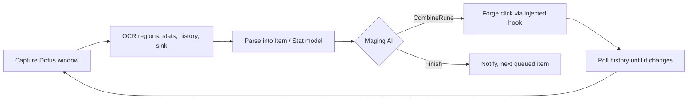

# inkybot

Windows desktop bot that automates "maging" (rune-based stat enchanting) in the MMORPG Dofus. It reads the game through screen capture and OCR, decides which rune to apply next, and clicks for you.

## What it is

- A .NET 4.8 WinForms app that docks the running Dofus client inside its own window, watches the maging workshop via OCR, and applies runes until an item's stats match a user-defined target.
- Built for a task that is slow, visual and repetitive by nature: one rune every few seconds, a static UI, and everything the bot needs already on screen. No packets, no memory reading.
- Ships with a built-in rule-based "maging AI"; power users can drop in their own C# strategy script, compiled at runtime.

## Background

- Dofus is Ankama's turn-based tactical MMORPG (2004). Players earn kamas (the currency), level professions and trade gear. Since December 2024 the PC client runs on Unity ("Dofus 3"), which is what this bot targets: it reads the Ankama Launcher's `dofus3` settings to find the game and its language.
- Maging (French *forgemagie*, English *smithmagic*) modifies an item's stats by applying runes. An attempt can succeed, fail, or knock other stats down; the "sink" (*puits*) is a running budget of lost stat power that can be spent to land harder runes. Pushing a stat past its cap is an over-mage; adding a stat the item never had is an "exo".
- By hand this is hundreds of click / check / decide cycles per item. Inkybot runs the loop.

## How it works

- Tick loop: `ScreenReaderDofusMagingJob` runs on a background thread. Each `Tick` = read screen, resolve an action, execute it, wait for the mage history to change, read the new sink. Nothing is assumed; every combine is verified on screen.
- Screen reading: `DofusScreenScan` crops fixed regions from a window capture (ScreenRecorderLib by default, Windows.Graphics.Capture and Win32 `PrintWindow` as fallbacks), preprocesses with Magick.NET, runs Tesseract (English, French and digits models) and corrects with SymSpell.
- Decisions: `DofusMagingAI` chains resolvers (Target, Perfection, ReachMinimum, FinishSink, Exo) against a per-stat config: target, minimum, priority, allowed rune sizes. Deterministic, no ML.
- Input: `InkybotHook` is an EasyHook DLL injected into the Dofus process. It hooks `PeekMessageW`, raw-input and cursor APIs to forge clicks Unity accepts, so maging works with the game in the background while you keep your mouse.
- Account and API: the client logs in to inkybot-web with OAuth, checks subscription or trial, streams rune statistics, publishes exo screenshots and triggers Discord / push notifications. Payloads are AES-256-CBC encrypted.
- English and French UI, auto-detected from the game's own settings.

## Tech stack

- C# / .NET Framework 4.8, WinForms, x64; legacy `.csproj` built with MSBuild.
- Tesseract 5, Magick.NET, SymSpell; ScreenRecorderLib, Windows.Graphics.Capture, SharpDX for capture.
- EasyHook (process injection), Westwind.Scripting + Roslyn (custom AI scripts), NLog, Newtonsoft.Json.
- ConfuserEx obfuscation on Release builds; NUnit 3 tests; GitHub Actions build and release workflows.

## Repository layout

- `Inkybot/` - the WinForms app: forms, OCR and capture services, maging job, AI resolvers, API client.
- `Inkybot.Dofus/` - domain library (Item, Stat, Rune, MageConfig) and the `DofusMagingAI` base class custom scripts extend.
- `InkybotHook/` - the injected DLL; its README documents the reverse-engineered Unity input pipeline.
- `Script.Crocoring/`, `Script.Gelano/` - example custom maging AI scripts. `Tests/` - NUnit tests against real screenshots.

## Building

- Open `Inkybot.sln` in Visual Studio or Rider, or run what CI does: `nuget restore Inkybot.sln` then `msbuild Inkybot.sln /p:Configuration=Release`.
- Pushing a `v*` tag builds on `windows-latest` and publishes a zipped GitHub release.

## Related

- [inkybot-web](https://github.com/kpolicar/inkybot-web) - the Laravel backend and website: accounts, subscriptions, the API this client talks to, Discord bot and release notes.

## Status

Personal project, not affiliated with Ankama. The hosted backend (inkybot.me) has been shut down; the current build runs in `OfflineMode` against a mocked API with telemetry disabled. Source is not licensed for redistribution (see `LICENSE`).
