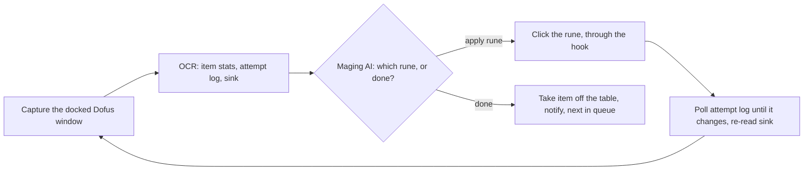
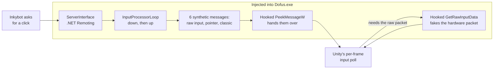

# inkybot

Windows desktop bot that automates "maging" (re-rolling an item's stats with runes) in the MMORPG Dofus: it reads the game through screen capture and OCR, picks the next rune, and clicks for you.

## What it is

- A .NET 4.8 WinForms app that docks the running Dofus client inside its own window, reads the maging table by OCR and applies runes until the item's stats reach the targets you set. Up to 45 inventory items can be queued.
- It reads pixels, not packets or memory. The only code inside the game is `InkybotHook`, a DLL from reverse-engineering the Unity client's Win32 input path (10 hooked functions, forged raw-input packets) so clicks land while you keep your mouse.
- Solo project, ~750 commits, 24 releases from v0.1 beta (Nov 2020) to v3.2 (Mar 2026), sold by subscription through the sibling backend. 80 NUnit tests, 47 real game screenshots as OCR fixtures.

## Background

- Dofus is Ankama's turn-based tactical MMORPG (2004). The target here is the Unity-based Dofus 3 client, supported since v3.0 (Dec 2024).
- Maging (*forgemagie* / smithmagic) applies runes to an item; each attempt can succeed, fail or knock other stats down. Landing an AP or MP point the item never had (an "exo") takes many attempts and careful sink management.
- The author's write-up, `article.md`, explains why OCR was chosen over packets: players mage on their main accounts, so detection risk drove the design. It predates the input hook.

## How it works

The maging loop reads the table, decides, clicks, and verifies the result on screen before moving on.



- **Verify-on-screen tick loop.** Each `Tick` on a background thread reads the screen, resolves one action, clicks, then polls the game's attempt log until a line changes. Three timeouts on one rune means out of runes; a changed stat layout aborts.
- **Screen reading.** Fixed regions are cropped from a Windows.Graphics.Capture frame (Win32 `PrintWindow` after blank frames), cleaned with Magick.NET and read by Tesseract 5 with SymSpell correction. Sink and stats are prefetched while the log is polled.
- **Decisions.** Ten deterministic resolvers (`Services/*ItemMageResolve.cs`) run in order: safe combines toward targets, perfection only when spare sink covers the hard minimums, over-mage only to reach a minimum, exo last. Stat points carry sink weights (Vitality 0.2, AP 100): it is a budget planner.

Clicking is the hard part. Dofus reads raw input and pointer messages, so `SendInput` does nothing; instead a DLL is injected into the game and feeds it synthetic input from the inside.



- **Inside the hook.** Ten Win32 functions are detoured with EasyHook. `PeekMessageW` is the dispatcher; `GetRawInputData` and `GetRawInputBuffer` fabricate `RAWINPUT` packets; `GetCursorPos`, `GetAsyncKeyState`, `GetCapture` and `ReleaseCapture` keep the game believing a real button is held. The app runs elevated and normalises the game's UI scale so OCR regions line up.
- **Custom strategies.** A C# file extending `CustomDofusMagingAI` is compiled at runtime with Roslyn and can veto or replace any stage; `Script.Crocoring/` farms sink to a multiple of 10 before attempting an AP exo.
- **Account and language.** OAuth login to inkybot-web; batches rune statistics, publishes exo screenshots, triggers Discord / push notifications. English or French UI, picked from the game's settings.

## Tech stack

- C# / .NET Framework 4.8, WinForms, x64; legacy `.csproj` built with MSBuild; NUnit 3 (tests are not run in CI).
- Tesseract 5, Magick.NET, SymSpell; Windows.Graphics.Capture + SharpDX with a Win32 `PrintWindow` fallback.
- EasyHook, Westwind.Scripting + Roslyn, NLog; ConfuserEx obfuscation on Release; GitHub Actions build and release workflows.

## Repository layout

- `InkybotHook/` — the injected DLL; start with its README for the deduced per-frame Unity input model.
- `Inkybot/Services/` — capture, OCR (`DofusScreenScan`), the maging job (`MagingJob/Tick.cs`) and the resolvers.
- `Inkybot.Dofus/` — domain model (Item, Stat, Rune, MageConfig) and the base classes custom scripts extend.
- `Script.Crocoring/`, `Tests/` — example strategies; NUnit tests over the AI and OCR against real screenshots.
- `article.md`, `CLAUDE.md` — design write-up and architecture notes; parts predate the hook.

## Running it

```
nuget restore Inkybot.sln
msbuild Inkybot.sln /p:Configuration=Release
```
A `v*` tag publishes a zipped GitHub Release from CI and can ship it to the web app's download storage; EasyHook's native files must be copied from the NuGet cache first (see `build.yml`).

## Related

- [inkybot-web](https://github.com/kpolicar/inkybot-web) — the Laravel backend and site: accounts, subscriptions, the encrypted API this client talks to, Discord bot, release notes.

## Status

Backend shut down; since July 2026 the client runs offline against a mocked API, telemetry off.
Personal project by Klemen Poličar. Not affiliated with Ankama SAS; Dofus is their trademark. Source is not licensed for redistribution (see `LICENSE`).
